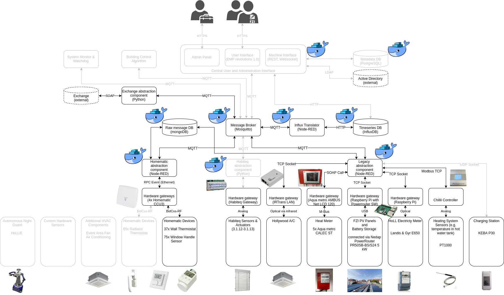

This program supports an efficient implementation of a abstraction schema to allow the communication with distributed devices (sensors/actuators) over a central API.

# General Concepts

* Should look something like this:
  

* Components:
  * Devices: using any form of communications. Can be virtual devices too, e.g. a webservice providing some weather data.
  * Hardware Gateways: Translating device specific communication to Ethernet.
  * Connectors: Connect Gateways with message broker and translate device specific messages to standardized message format used to communicate with the brokers.
  * Message Broker: Internally connects all components.
  * DBs: One Time series DB for numeric values and one NoSQL DB for objects.
  * API: Interface for data access and administration of datapoints and meta data. Can be used to host a user interface (website) too.
* Each component runs in a docker container. The overall application can be created by configuring the desired components in a docker-compose file.

# Folder Structure

### API

Contains Code for the API 

### connectors

Contains ready-to-use connectors, that only require configuration (via Environment variables) to connect some devices (e.g. some devices connected to one hardware gateway) or virtual devices (some data accessible via http call)

### connector_templates

Contains templates that can be used to efficiently create new connectors.

### demo

Contains a functional demo of the approach for illustration.

### documentation

Contains more detailed documentation, e.g. on the internal [message format](./documentation/messages.md) and more details on [connectors](./documentation/connectors.md).

