Creating BEMCom Applications

Recalling the [application concept](https://bemcom.readthedocs.io/en/latest/01_concepts.html#application-concept), it is apparent that a functional and building specific HAL instance will require one API service (including the metadata database), one message broker, one or more connector services, and optionally a raw message database service. The BEMCom repository provides fully functional implementations of an API service, a message broker and a raw message database which should be sufficient for most applications, thus effectively removing the burden of implementing these services from the user. Furthermore, a limited set of connector services is available, including connectors to integrate devices communicating via Modbus/TCP, MQTT, or the Open Charge Point Protocol (OCPP). All available services can be found in the [services](https://github.com/fzi-forschungszentrum-informatik/BEMCom/tree/master/services) folder in this repository.

Leveraging the design concepts of BEMCom, i.e. the service oriented approach and the execution of services as Docker containers, creating an application is reduced to simply configuring and starting the selected services.


## Creating Applications with Docker

This is a minimal example showing how a functional BEMCom application can be created by manually starting each service via a shell command, which should work on any machine having Docker installed. Please note that the more convenient way to achieve the same result by utilizing Docker Compose is subject to the [following section](https://bemcom.readthedocs.io/en/latest/02_application_creation.html#creating-applications-with-docker-compose).

### Demo Device

In order to demonstrate the full functionality of BEMCom it is certainly necessary to begin with a device to communicate with. To that end we provide a [Demo Device](https://bemcom.readthedocs.io/en/latest/05_service_reference.html#demo-device) service reflecting a simple Modbus device which can be interpreted as a single room for which the temperature is measured and an actor (say an AC system that can heat and cool) exists to manipulate the room temperature. However, before the first service is started it is necessary to create a Docker network to allow communication between the services.

```bash
docker network create bemcom-demo
```

After the Docker network exists, it is possible to start the Demo Device with:

```bash
docker run -d --network bemcom-demo --name bemcom-demo-device bemcom/demo-device-tool:0.1.0
```

Here the `-d` flag will cause Docker to run the Demo Device in the background, `--network bemcom-demo` will connect the container to the previously created network and  `--name bemcom-demo-device` will assign the network name `bemcom-demo-device` to the container. To confirm that the Demo Device has been started successfully execute:

```bash
docker logs bemcom-demo-device
```

Which should create an output similar to this one:

```
docker-entrypoint.sh: Starting up
2022-02-03 09:06:04,884-run-INFO: Current temperature: 21.0
```

### Message Broker

Each BEMCom application requires a central message broker service to allow communication between the remaining services. The broker can be launched using the following command:

```bash
docker run -d --network bemcom-demo --name bemcom-demo-mqtt-broker bemcom/mosquitto-mqtt-broker:0.1.0
```
Checking the container logs with `docker logs bemcom-demo-mqtt-broker` indicates the correct operation by displaying:

```
1643880100: mosquitto version 1.6.10 starting
1643880100: Config loaded from /mosquitto/config/mosquitto.conf.
1643880100: Opening ipv4 listen socket on port 1883.
1643880100: Opening ipv6 listen socket on port 1883.
```

### Connector

In order to establish communication between the Demo Device and the message broker it is necessary to spin up the corresponding connector, in this particular case that is the [Modbus/TCP connector](https://bemcom.readthedocs.io/en/latest/05_service_reference.html#modbus-tcp-connector) provided in the BEMCom repository, by typing:

```bash
docker run -d --network bemcom-demo --name bemcom-demo-modbus-tcp-connector -e MQTT_BROKER_HOST=bemcom-demo-mqtt-broker -e MQTT_BROKER_PORT=1883 -e CONNECTOR_NAME=bemcom-demo-modbus-tcp-connector -e MODBUS_MASTER_IP=bemcom-demo-device -e MODBUS_MASTER_PORT=502 -e POLL_SECONDS=5 -e MODBUS_CONFIG='{"read_input_registers": [{"address": 1,"count":1,"unit": 1,"datatypes": "e"}],"write_register": [{"address": 1,"unit": 1,"datatypes": "<e","example_value": "22.0"}]}' bemcom/modbus-tcp-connector:0.5.0
```

Albeit this shell command may look far more complex than the ones introduced above, it is actually very similar. The only difference is that the connector service is additionally configured via environment variables (i.e. the terms following `-e`) to account for specific settings of the device and the application. In particular, these variables can be interpreted as:

* `MQTT_BROKER_HOST=bemcom-demo-mqtt-broker`: Configures that the connector should connect to the MQTT broker with the network name `bemcom-demo-mqtt-broker`, i.e. the name that has been given in the command above.
* `MQTT_BROKER_PORT=1883`: Specifies that the MQTT broker expects a connection on port `1883`, which is the default value for MQTT.
* `CONNECTOR_NAME=bemcom-demo-modbus-tcp-connector`: Defines the internal name (i.e. the root topic) as  `bemcom-demo-modbus-tcp-connector` for the information exchange on the broker between the connector and other services.
* `MODBUS_MASTER_IP=bemcom-demo-device`: Specifies the network name or IP address of the Modbus/TCP device that the connector will attempt to communicate with to `bemcom-demo-device`, i.e. the name that has been given in the command above.
*  `MODBUS_MASTER_PORT=502`: Defines that the demo device expects connections on port `502`, which is the default value for Modbus/TCP.
* `POLL_SECONDS=5`: Declares that the connector should request the configured sensor values (see below) every five seconds by polling the device.
* `MODBUS_CONFIG='{"read_input_registers": ... }'`: Configures the Modbus registers which the connector will attempt to read from or write to. In particular, the connector is set up to handle a single sensor datapoint for input register `1` and a single actuator datapoint for holding register `1`. It is worth noting here that the concept of registers is specific to Modbus and that the information which information is exposed on which register is device specific and usually described in the documentation belonging to the device.

At this point it is important to highlight two important properties about the configuration of BEMCom services via environment variables:

1. It is solely necessary to change the environment variables to adapt a BEMCom service for a particular application or to a specific device. For example, if one would need to connect a second different Modbus device to the demo application above it is intended to use the same image of the Modbus/TCP connector with adjusted environment variables. It is thus possible to very quickly establish connection to even larger numbers of devices, at least if suitable connectors for those exist.
2. Which environment variables are available varies per BEMCom service. A documentation about how to configure each service utilizing those variables is provided in the documentation of the services. Regarding the current example, the documentation of the [Modbus/TCP connector](https://bemcom.readthedocs.io/en/latest/05_service_reference.html#modbus-tcp-connector) provides additional details for each environment variable including e.g. extensive discussion how to define the `MODBUS_CONFIG` variable correctly.

Before moving on it is again a good idea to verify the correct operation of the connector by inspecting the logs with `docker logs bemcom-demo-modbus-tcp-connector`, which should yield an output similar to:

```
2022-02-03 11:22:19,416-_get_stream-INFO: Python-dotenv could not find configuration file .env.
2022-02-03 11:22:19,416-parse_modbus_config-INFO: Parsing MODBUS_CONFIG.
2022-02-03 11:22:19,417-_get_stream-INFO: Python-dotenv could not find configuration file .env.
2022-02-03 11:22:19,417-__init__-INFO: Initiating pyconnector.Connector class for: bemcom-demo-modbus-tcp-connector
2022-02-03 11:22:19,417-__init__-INFO: Changing log level to INFO
2022-02-03 11:22:19,421-run-INFO: Connector online. Entering main loop.
```

### API

At this point only an API service is missing to form a fully functional BEMCom application. The following command allows to create a container with such a service:

```bash
docker run -d --network bemcom-demo -p 8080:8080 --name bemcom-demo-django-api -e MQTT_BROKER_HOST=bemcom-demo-mqtt-broker -e MQTT_BROKER_PORT=1883 -e DJANGO_SUPERUSER_USERNAME=bemcom -e DJANGO_SUPERUSER_PASSWORD=bemcom -e DJANGO_SUPERUSER_EMAIL=bemcom@example.com -e DJANGO_ALLOWED_HOSTS='["*"]' bemcom/django-api:0.8.1
```

Similar to the connector service above, the API service is configured via environment variables to connect to the message broker. Additionally three environment variables starting with `DJANGO_SUPERUSER_` are exposed to the service which define the login credentials and email address of an administrator user. The latter allows to configure which datapoints of the devices will be used by the BEMCom application, to edit the metadata of these datapoints but also allows administration of access control mechanisms to prevent the REST interface of the API service from unauthorized usage. The values of these three variables are obviously not suitable for any productive use and should be changed for any non demo application. This also holds for `DJANGO_ALLOWED_HOSTS` variable, which is security relevant, but not important to understand for the sake of demonstrating a simple BEMCom application. Additional details on this and all available environment variables are provided in the [documentation page of the API service](https://bemcom.readthedocs.io/en/latest/05_service_reference.html#django-api).

In order to verify that the API service operates as intended, one can inspect the logs once more with `docker logs bemcom-demo-django-api` which will generate a longer output. The important line to check for should look like this:

```
2022-02-07 08:48:47,751-daphne.server-INFO: Listening on TCP address 0.0.0.0:8080
```

This indicates that the API service operates and the REST interface as well as the graphical administration user interface are exposed on container port `8080`, which should also be available on the same port of the host machine.

### Conclusion

Congratulations! You now operate a functional BEMCom application! Before it is possible to access the datapoint data via the REST interface it is necessary to configure the datapoint metadata in the administration user interface provided by the API service. This is described [below](https://bemcom.readthedocs.io/en/latest/02_application_creation.html#configuring-and-accessing-datapoints).


## Creating Applications with Docker Compose

As we have seen in the section above, starting each service manually is a tedious process. In practice it is usually better to write the desired application into a configuration file and execute this. One particularly simple way to implement such an approach is to utilize [Docker Compose](https://docs.docker.com/compose/gettingstarted/) . The following `docker-compose.yml` file will lead to the same result as the individual steps above, where more detailed explanation is provided.

```yaml
version: '3'

services:

    bemcom-demo-device:
        container_name: bemcom-demo-device
        image: bemcom/demo-device-tool:0.1.0

    bemcom-demo-modbus-tcp-connector:
        container_name: bemcom-demo-modbus-tcp-connector
        image: bemcom/modbus-tcp-connector:0.5.0
        depends_on:
            - bemcom-demo-device
            - bemcom-demo-mqtt-broker
        environment:
            - CONNECTOR_NAME=bemcom-demo-modbus-tcp-connector
            - MQTT_BROKER_HOST=bemcom-demo-mqtt-broker
            - MQTT_BROKER_PORT=1883
            - POLL_SECONDS=5
            - MODBUS_MASTER_IP=bemcom-demo-device
            - MODBUS_MASTER_PORT=502
            - 'MODBUS_CONFIG={"read_input_registers": [{"address": 1,"count":1,"unit": 1,"datatypes": "e"}],"write_register": [{"address": 1,"unit": 1,"datatypes": "<e","example_value": "22.0"}]}'

    bemcom-demo-mqtt-broker:
        container_name: bemcom-demo-mqtt-broker
        image: bemcom/mosquitto-mqtt-broker:0.1.0

    bemcom-demo-django-api:
        container_name: bemcom-demo-django-api
        image: bemcom/django-api:0.8.1
        depends_on:
            - bemcom-demo-mqtt-broker
        ports:
            - 8080:8080
        environment:
            - MQTT_BROKER_HOST=bemcom-demo-mqtt-broker
            - MQTT_BROKER_PORT=1883
            - 'DJANGO_ALLOWED_HOSTS=["*"]'
            - DJANGO_SUPERUSER_USERNAME=bemcom
            - DJANGO_SUPERUSER_PASSWORD=bemcom
            - DJANGO_SUPERUSER_EMAIL=bemcom@example.com

```


Using this file the BEMCom application can be started using a simple `docker-compose up` command. Please refer to the [official documentation](https://docs.docker.com/compose/) for more details about Docker Compose and how to use it.


## Configuring and Accessing Datapoints

Once the BEMCom demo application has been started with either one of the two approaches introduced in the previous sections, it remains to configure the datapoints. This can be done utilizing the graphical administration user interface provided by the API service. Assuming that the containers are executed on the local machine, one can access the UI on the following URL:

```
http://localhost:8080/admin/
```

Visited for the first time the login prompt should be shown.


### The Main Page

After logging in with the credentials configured above (user: `bemcom` password: `bemcom` by default), the main page of the administration panel is shown.

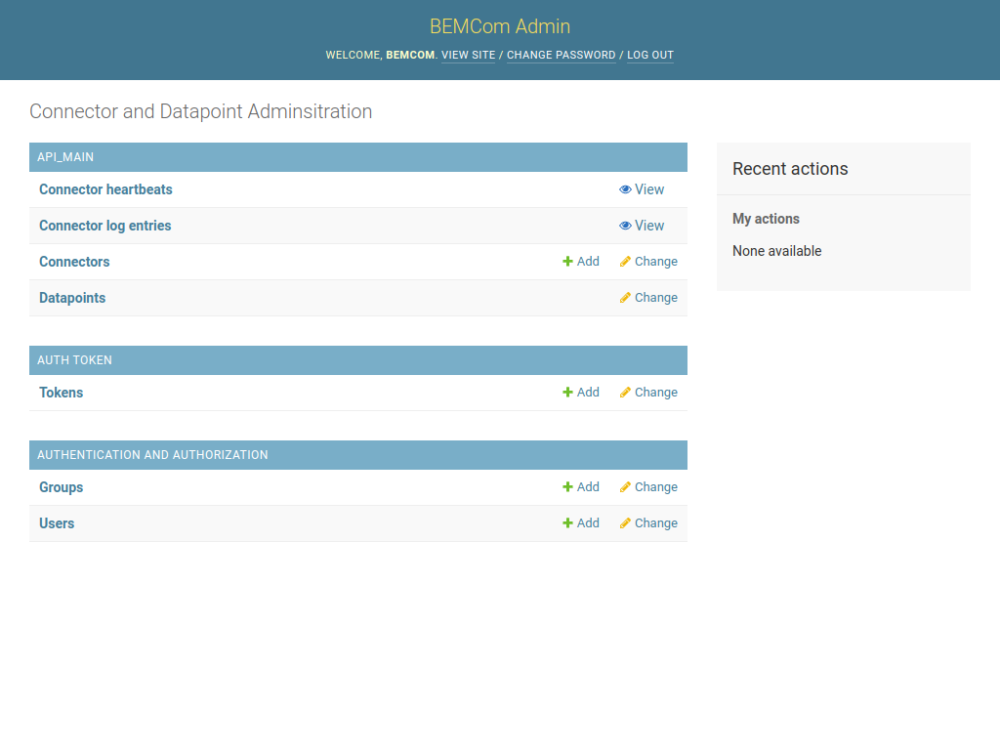

### Editing Connectors

Before we can configure any datapoints, it is necessary to add the connector. Click on the `Connectors` entry to view all available connectors, which are none so far.

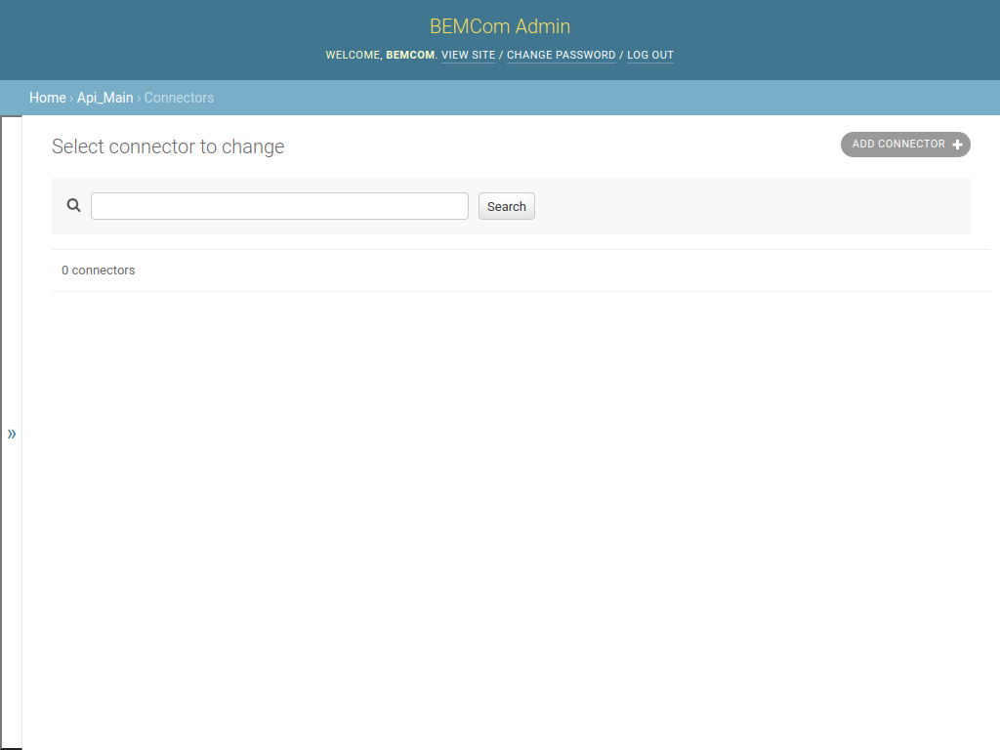

Create a new connector item by clicking the `ADD CONNECTOR` button on the right upper corner. This opens the following dialog that allows specifying a name of a connector that should be added.

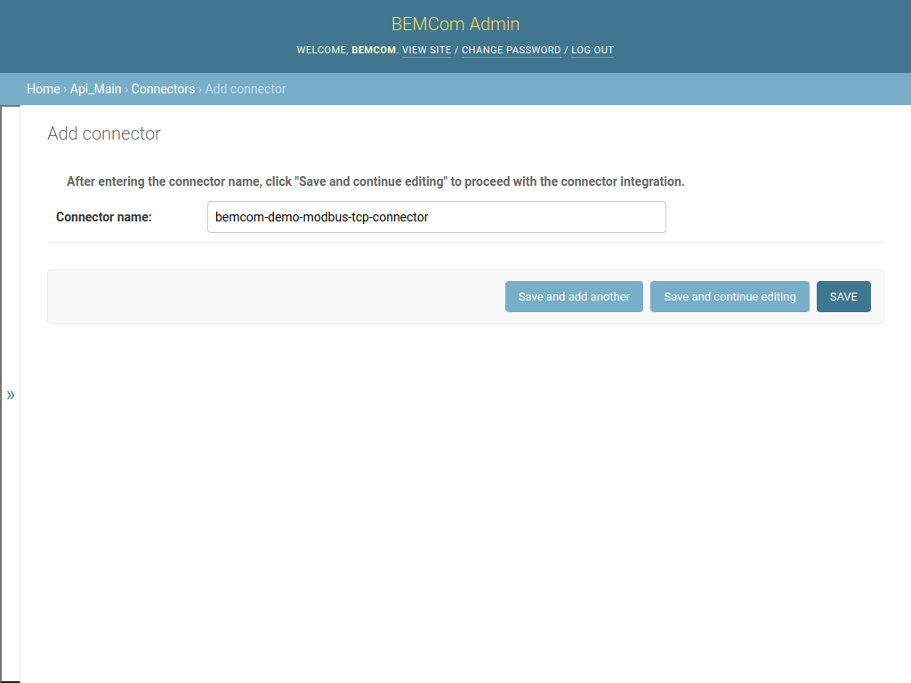

Please note that the name that is put into the `Connector name:` field must match the `CONNECTOR_NAME` environment variable set during execution of the `docker` command or specified in the `docker-compose.yml` file. In the example above the name of the connector was set to `bemcom-demo-modbus-tcp-connector` hence fill in that value and click on the `Save` button. The created connector is now listed in the Connector list page.

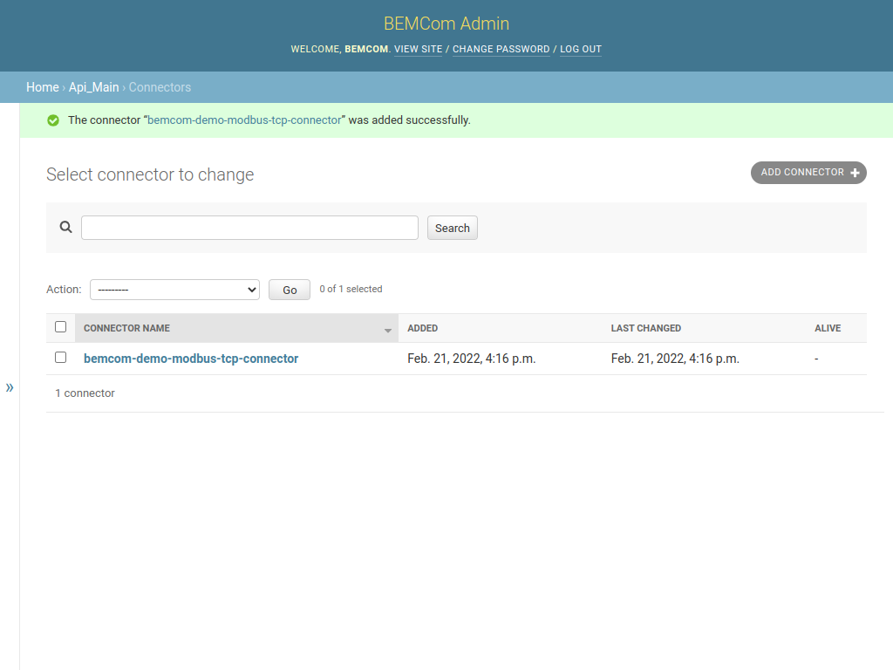

One can view the connector detail page by clicking on the name of the connector. This pages shows aggregated metadata, like the date of the last received heartbeat and the number of datapoints, but also additional information like the MQTT topics the connector interacts with and the emitted log messages. 

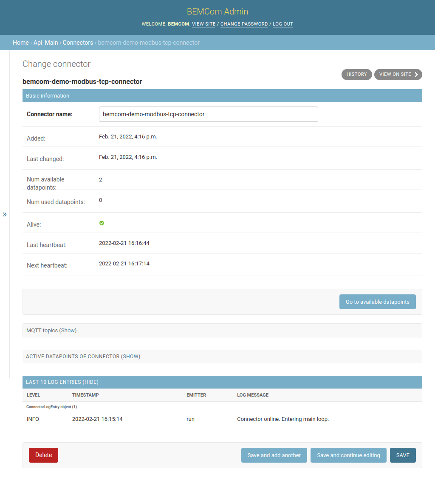

### Editing Datapoints

To administrate the Datapoints of the connector click the "Go to available datapoints" button which yields the following page. (Note that this is equivalent to clicking on the Datapoint entry in the main menu and setting appropriate filters.)

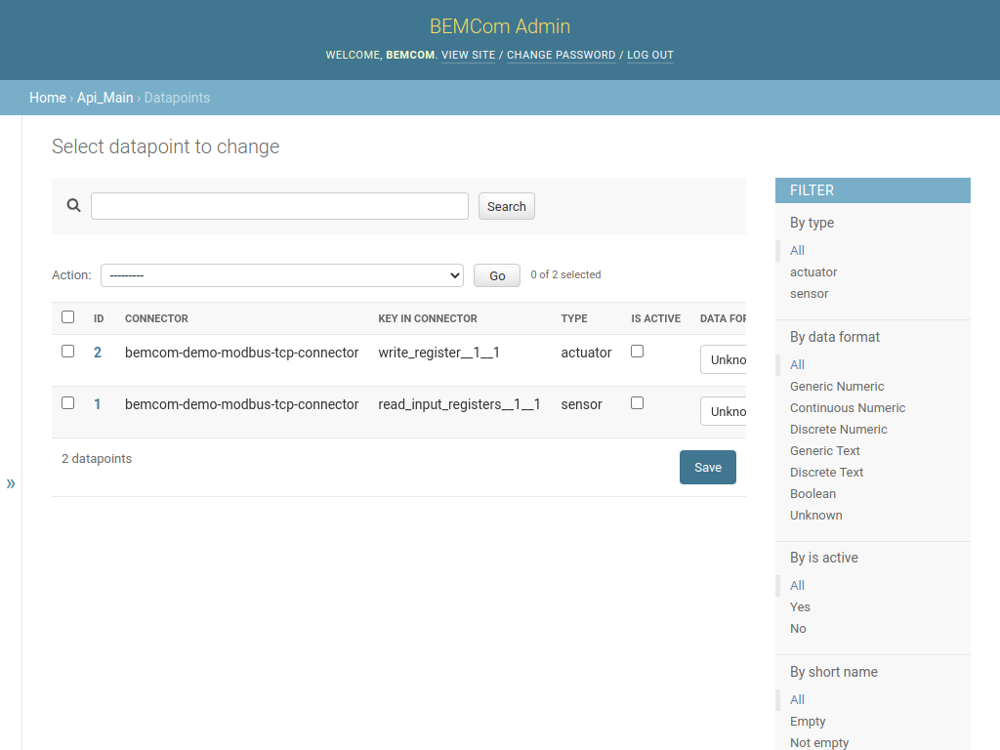

The next step would be to enter the metadata of the datapoints that should be exposed on the REST API. Click the ID `1` to view the datapoint detail page of the first datapoint, and change the fields to the following values. Note that the existence of the  `Unit` field depends on the selected value of `Data format`, and that one has to click the `Save and continuo editing` button after changing `Data format` to make the fields under `DATA FORMAT SPECIFIC METADATA` appear.

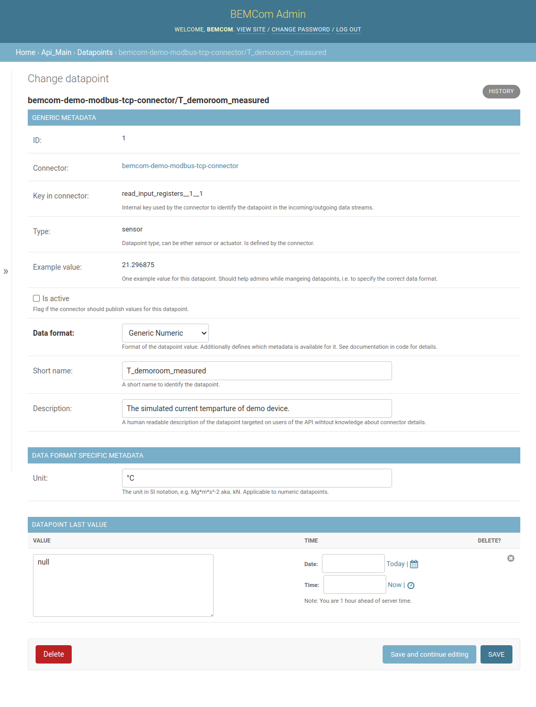

Proceed by editing the second datapoint accordingly. Note that datapoints of type "Continuous Numeric" allow for two additional fields, `Min value` and `Max value`. These fields can be used to specify a valid range of values which will be enforced by the REST API, i.e. it will not be allowed to set this value outside this range.


Finally, it is worth noting that larger fractions of the metadata can be edited in the list view of datapoints too. For example, to flag datapoints as active (which will make the connector send data for sensor datapoints and listen for values for actuator datapoints but also expose those datapoints on the REST API) one can simply click the `IS ACTIVE` checkboxes and afterwards the`Save` button. Afterwards the datapoint list page would look like this:

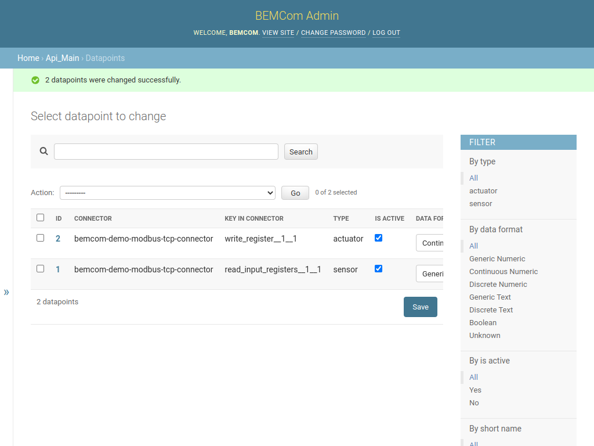

### Administration of User Accounts and Permissions

One last thing to allow communication with the devices with the REST interface is to setup a user account with appropriate permissions and an access token. **Note: You should keep your admin credentials secret and not forward those to other machines or humans to allow them accessing the REST interface.**

Click on `Home` to return to the main page and afterwards on `Users` to view the list of known user accounts.

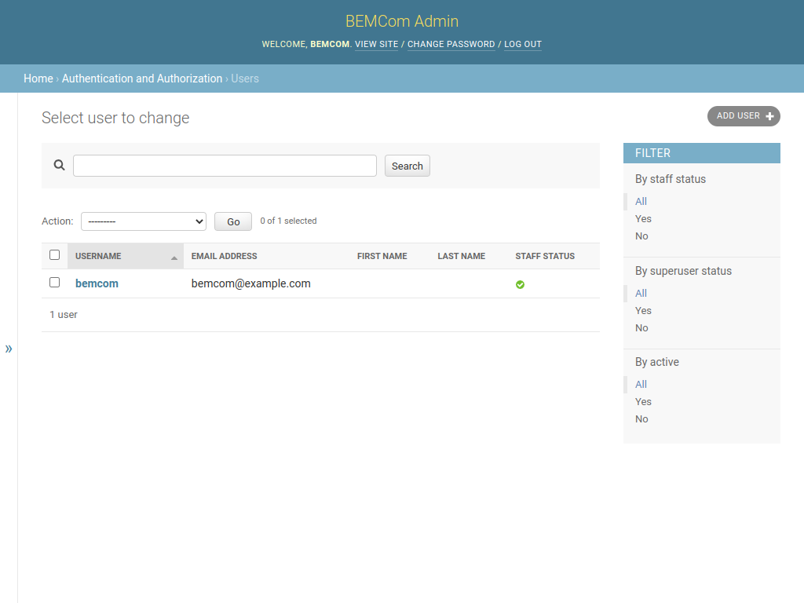

Now click on `ADD USER` to add a new user account, fill the fields and click on `Save and continue editing` once finished. 

Now add the `User permissions` the user should be granted. Sane values for the demo are:

* `api_main | datapoint | Can view datapoint` -> To allow the user to view datapoint metadata.
* `api_main | datapoint last value | Can view datapoint last value` -> To allow the user to fetch the last known values of all active sensor and actuator datapoints.
* `api_main | datapoint value | Can add datapoint value` -> To allow the user to send values to all active actuator datapoints. 

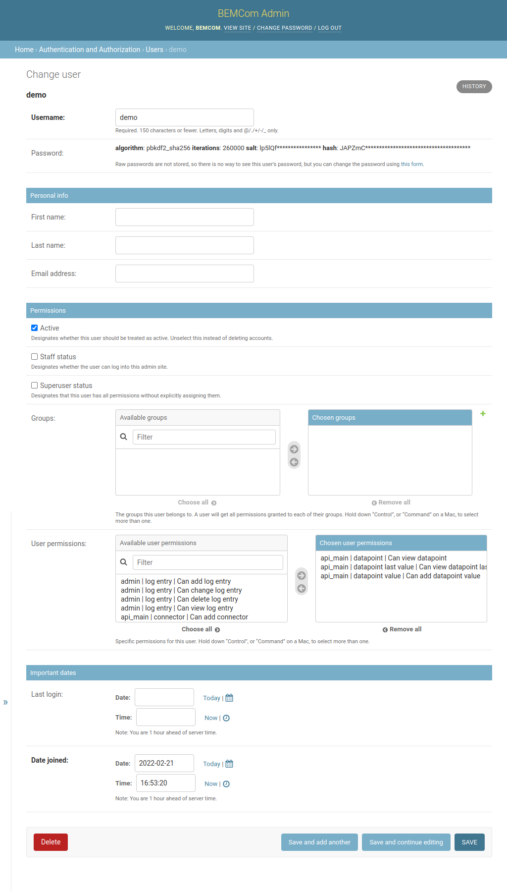

Finally click the `Save` button to proceed. While there should now exist a user with sufficient permissions one will usually not want to login with user name and password for automatic accessing of APIs. Hence, click `Home` to return to the main page and afterwards `Token` to view the Token list page, which is yet empty.

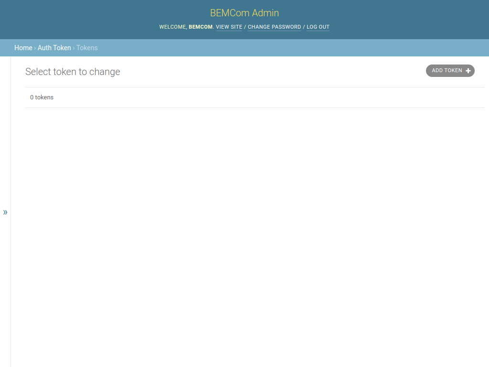

Click on `ADD TOKEN` to generate a access token for the demo user, then select the user name from the `User` dropdown menu and hit `SAVE`. This should return a page like the following:

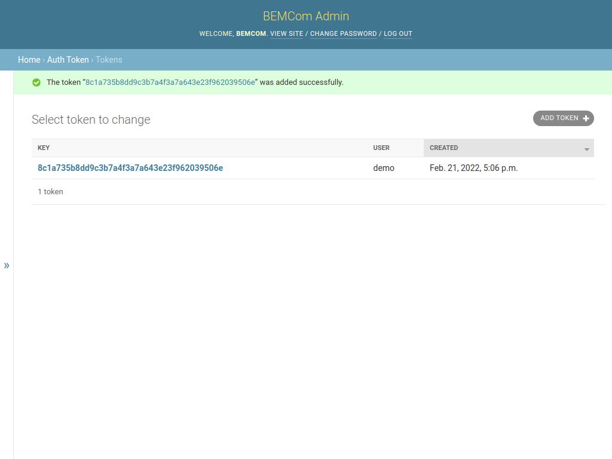

Using the token value obtained it should now be possible to interact with the REST API.

### Interacting with the REST API

The commands below demonstrate the interaction with the REST API using [curl](https://curl.se/) commands. Before we go on one should store the token in a environment variable for convenience. 

```bash
TOKEN=<Place the token of the demo user here>
```

The `/datapoint/` endpoint allows to interact with the metadata of the datapoints. To fetch the metadata of all (active) datapoints one can simply execute:

```bash
curl -X "GET" \
  "http://localhost:8080/datapoint/" \
  -H "Authorization: Bearer $TOKEN"
```

The command prompts the following output:

```json
[{"id":1,"connector":{"name":"bemcom-demo-modbus-tcp-connector"},"key_in_connector":"read_input_registers__1__1","type":"sensor","data_format":"generic_numeric","short_name":"T_demoroom_measured","description":"The simulated current temparture of demo device.","min_value":null,"max_value":null,"allowed_values":null,"unit":"°C"},{"id":2,"connector":{"name":"bemcom-demo-modbus-tcp-connector"},"key_in_connector":"write_register__1__1","type":"actuator","data_format":"continuous_numeric","short_name":"T_demoroom_setpoint","description":"The setpoint temperature used for simulation of demo device","min_value":15.0,"max_value":35.0,"allowed_values":null,"unit":"°C"}]
```

The output looks much nicer if formated to usual JSON convention:

```json
[
   {
      "allowed_values" : null,
      "connector" : {
         "name" : "bemcom-demo-modbus-tcp-connector"
      },
      "data_format" : "generic_numeric",
      "description" : "The simulated current temparture of demo device.",
      "id" : 1,
      "key_in_connector" : "read_input_registers__1__1",
      "max_value" : null,
      "min_value" : null,
      "short_name" : "T_demoroom_measured",
      "type" : "sensor",
      "unit" : "°C"
   },
   {
      "allowed_values" : null,
      "connector" : {
         "name" : "bemcom-demo-modbus-tcp-connector"
      },
      "data_format" : "continuous_numeric",
      "description" : "The setpoint temperature used for simulation of demo device",
      "id" : 2,
      "key_in_connector" : "write_register__1__1",
      "max_value" : 35,
      "min_value" : 15,
      "short_name" : "T_demoroom_setpoint",
      "type" : "actuator",
      "unit" : "°C"
   }
]
```

Note that the values are precisely the information that has been edited with the graphical admin user interface before.

In a similar manner one can retrieve the last values per datapoint by executing from the `/datapoint/last_value/` endpoint:

``` bash
curl -X "GET" \
  "http://localhost:8080/datapoint/last_value/" \
  -H "Authorization: Bearer $TOKEN"
```

This command yields a raw response of:

```json
{"msgs_by_datapoint_id":{"1":{"value":"24.0","timestamp":1645474710272}}}
```

And again as pretty printed:

```json
{
   "msgs_by_datapoint_id" : {
      "1" : {
         "timestamp" : 1645474760276,
         "value" : "24.0"
      }
   }
}
```

Note that there is no value for the second datapoint (the actuator datapoint) yet as no value has been pushed to it yet.  In order to change this and write values to actuator datapoints one can use the `/datapoint/{dp_id}/value/` enpdoint like:

```bash
curl -X "POST" \
  "http://localhost:8080/datapoint/2/value/" \
  -H "Authorization: Bearer $TOKEN" \
  -H 'Content-Type: application/json' \
  -d '{"value": "17.0", "timestamp": 1645470000000}'
```

If one now polls the `/datapoint/last_value/` endpoint again a result similar to this one should be returned:

```json
{
   "msgs_by_datapoint_id" : {
      "1" : {
         "timestamp" : 1645475475333,
         "value" : "18.703125"
      },
      "2" : {
         "timestamp" : 1645470000000,
         "value" : "17.0"
      }
   }
}
```

After setting the value of the actuator datapoint to 17.0 degrees this value is now known to the system as last value of the actuator datapoint.  Finally once can observe that the value of the simulated sensor datapoint  has changed and now moves towards the setpoint.

### Documentation of the REST API

Finally is worth mentioning that the REST API of the API service provides an extensive interactive documentation using [Swagger UI](https://swagger.io/tools/swagger-ui/). Assuming again that the containers are executed on the local machine, one can access the interactive API root at the following URL:

```
http://localhost:8080/
```

This should show a page like this:

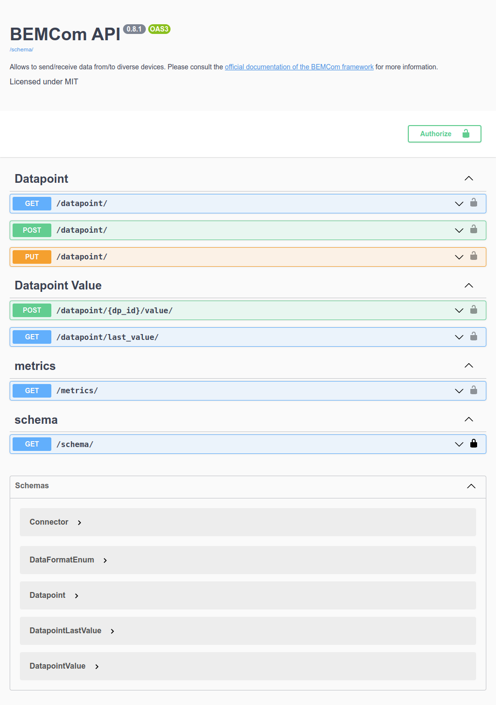

## Cleaning Up

#### With Docker

If the containers were created manually (i.e. by executing one `docker run` command per service) the following commands stop and remove the containers and the network.

```bash
docker container stop bemcom-demo-device bemcom-demo-modbus-tcp-connector bemcom-demo-mqtt-broker bemcom-demo-django-api
docker container rm bemcom-demo-device bemcom-demo-modbus-tcp-connector bemcom-demo-mqtt-broker bemcom-demo-django-api
docker network rm bemcom-demo
```

### With Docker Compose

If the demo application has been started with Docker Compose the following command should be sufficient to achieve the same result:

```bash
docker-compose down
```

### Removing the Images

Finally, one may wish to remove the docker images that have been loaded to run the demo application (to free the hard drive) with the following command:

```
docker image rm bemcom/demo-device-tool:0.1.0 bemcom/modbus-tcp-connector:0.5.0 bemcom/mosquitto-mqtt-broker:0.1.0 bemcom/django-api:0.6.10
```


