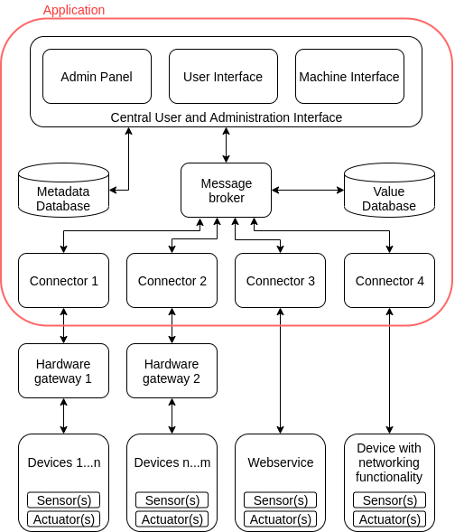

# BEMCom Concepts  

## Introduction

**BEMCom**, the **B**uilding **E**nergy **M**anagement **Com**munication framework, is a software framework for the rapid creation of HAL applications that allow communicating with diverse devices of buildings. BEMCom was initially designed as a support tool for scientific research projects on building energy management at the [FZI Research Center for Information Technology](https://www.fzi.de/en/about-us/). Such projects are usually characterized by settings like:

* The research project should optimize the energy consumption patterns of one or more buildings.
* Integration of 100+ distributed and heterogeneous sensor and actuator devices may be required. 
* All device communication should be possible over a single unified interface to decouple the communication from the optimization logic.
* It is regularly not possible to chose which devices can be used, instead it is necessary to integrate whatever device is already in the building. This implies:
  * It may be necessary to integrate devices that were not designed for machine to machine communication.
  * It may be necessary to integrate devices which use uncommon or vendor specific protocols for communication.
  * It may be necessary to integrate devices that employ flawed implementations of protocols or may show other forms of unexpected behavior.  

While developing HAL applications for such research projects is certainly important for the success of the project, it also appears not very interesting from a scientific point of view. Thus, our main interest regarding creation and maintenance of HAL applications is efficiency, i.e. to spend as little effort on these tasks as possible. The natural approach is therefore to use an existing software component as HAL application (instead of developing a custom solution). The most promising candidates are certainly the well established smart home projects, like [OpenHAB](https://www.openhab.org/) or  [Home Assistant](https://www.home-assistant.io/). However, practical experience has shown that a surprisingly large number of devices encountered in research projects are not supported by these tools, usually due to one of the three reasons listed above, which makes it necessary to implement a custom piece of software (a connector in BEMCom terminology) for each device to be integrated. Furthermore, it has also been found that extending these tools with custom connectors causes often much more effort then expected or necessary. BEMCom on the other hand is especially designed to minimize the necessary effort for creating and maintaining HAL applications. The following design principles have been employed to allow this.

## Design Concepts

### Service Oriented Architecture (SOA)

Components of any BEMCom application are isolated into services that communicate over a well-defined and limited set of messages. The application of SOA has several advantages:

- It is easy to build applications as the task is effectively reduced to selecting and configuring services. 
- Users can implement new services in nearly any programming language while still being able to make use of existing services.
- Reduced effort for developers to implement and maintain services as the complexity of a service is just a fraction of the overall application. Side effects of changes on one services on the application are less likely and easy to debug through inspection of the inter-service communication.

### Embrace existing software

One essential point to reduce the effort for implementation and maintenance of BEMCom applications is to avoid implementing components that have already been implemented by others, and instead embrace their work by integrating it. 

Considering the task of communicating with an entity over some arbitrary protocol that is specified by the manufacturer of the particular entity (i.e. developing a connector), it is quite common that some software exists that has already implemented the protocol. BEMCom is designed to allow the integration of such existing software components. A particularly interesting example could be a smart home software like OpenHab, which is able to communicate with hundreds of devices typically found in private households. In order to integrate OpenHab into BEMCom it is only necessary to develop a software that translates between the OpenHab API and the BEMCom message format, which is usually a significantly lower effort then reimplementing the protocols from scratch.

Reusing existing software, especially mature open source components, is also applied to reduce the implementation effort for other services. An illustrative example is the currently implemented message broker service, that heavily relies on the [Mosquitto MQTT broker](https://mosquitto.org) implementation. 

### Services as Docker containers

Each service is implemented as a Docker container. This procedure has the following advantages:

- As the application is distributed over several containers it scales well, and can easily be deployed to a computing cluster (e.g. Kubernetes) if that is necessary for performance reasons.
- Isolating each service in a container minimizes the possibilities of side effects between services as each container contains the full runtime environment required by the service. It also supports development efficiency as it can be guaranteed that each service behaves exactly the same, regardless if deployed on a development machine, a production server or even a cluster.
- Utilizing containers, especially in combination with Docker Compose, supports the separation of generic runtime logic from configuration, which helps designing services that generalize well.

# Application Concept

Each created application will consist of several services with different functionalities. Each service is thereby executed as a Docker container. The following shows the general flow of data in an application.

As already mentioned, the general purpose of BEMCom is to connect **devices** to a central interface.  Following common convention (e.g. as in the [BACnet protocol](https://en.wikipedia.org/wiki/BACnet)) devices are represented as **sensor and actuator** datapoints, where each **datapoint** represents a source or sink for values. For example, a room climate sensor may have two datapoints, one for the room temperature and one for the humidity. One measurement at one datapoint, e.g. 22.6 is referred to as **value**, the corresponding time of measurement, e.g. 1586873592000 (that is 2020-04-14T14:13:12 in milliseconds since epoch) as **timestamp**. The concept and information of value and timestamp also applies to actuators, besides that the value is no measurement but a set value in that particular case.

Devices may use any form of communication. If the communication is not Ethernet based, it is necessary to use **hardware gateways**. These are devices that translate the device specific communication to Ethernet. Following the example above, if the room climate sensor would communicate via Bluetooth, it would be necessary to use a hardware gateway to connect the room sensor to the application. This could be a Raspberry Pi that would forward the measured values from Bluetooth to a TCP socket.

Following upwards in the graph, the data flow has reached the application. The corresponding services are the **connectors**, which translate the gateway or device specific messages to the BEMCom internal message format. As this translation process may be destructive, it is optionally possible to store the raw unprocessed incoming messages from gateways or devices in a **raw message database**, which allows reprocessing the measured values if the data processing logic of connectors needs to be changed, e.g. to fix a bug. The communication between connector and raw message database is carried out by the **message broker** which connects all services with each other.

External access on the other hand is handled by the **API** service that provides a central communication interface for interaction with the application, but also provides a user interface to administrate the datapoint metadata like description or unit. This metadata might be required for external applications to utilize the data correctly and is stored in the **metadata database**. Returning to our example from above, an energy management system could receive the measured value (of 22.6) and timestamp of the temperature datapoint, as well as additional metadata (the unit of the value is °C), by querying the REST API provided by the API service. 

While the setup introduced above is generally sufficient to communicate with any device using sensor and actuator datapoints, it may not be ideal for setting actuator values, as the latter usually involves some form of control logic. For example, an energy management system may have computed an efficient strategy to cool a room, which involves switching off the air conditioning system for 15 minutes completely. Furthermore, it may be known that the occupants will tolerate this strategy as long as the room temperature is below 25°C. This effectively imposes the energy management system to continuously monitor the room temperature to ensure that the comfort constraint is not violated by sending appropriate actuator values (e.g. switch AC on) if the measured value reaches the comfort bounds. However, this setting has the disadvantage that a loss of communication between the energy management system and BEMCom may have unintended effects on the building. BEMCom provides thus the possibility to add **controller** services that allow the executions of schedules for actuator datapoints, while ensuring that the sensor value remains within the bounds defined by a setpoint message.

